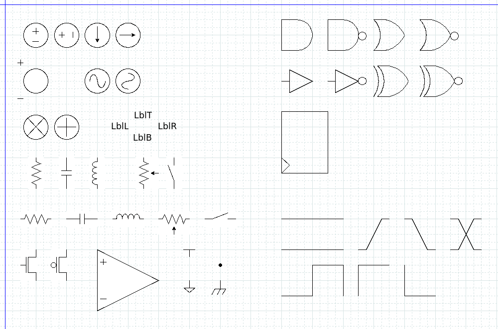

# SRH_circuit_shapes
shapes for analog and digital schematic and related diagrams

- These shapes were created in Dia 0.97+ git on Ubuntu, installed with apt-get.  
- Please feel free to open an Issue to discuss these.  
- Mainly I've created this repo for my own use and to share with colleagues,  
 but I'm happy to share these with the wider community.

## Installation
Copy the shape and png files in shapes/ to your user .dia/shapes directory.
Copy the sheet file(s) in sheets/ to your user .dia/sheets directory.

## Diagram settings and use
- These shapes are intended to be used on a diagram with a 0.25cm grid.
- Note: I recently built Dia 0.98 and found the grid cannot be set to finer than increments of 0.1cm, causing some of these shapes to align poorly. These are mainly the small power, ground and sub symbols.  I plan to get in touch with the project developers and may end up changing this library (hopefully not).
- Connection points are placed in convenient locations.  
- The initial shape line width is controlled by the line width selection at the lower left corner of the Dia window. It can also be modified with the Properties dialog.

## References
Latest 0.97.3 build <https://github.com/GNOME/dia/tree/master>  
Older documentation and 0.97.2 builds for Windows, Mac and Linux <http://dia-installer.de/>

## Symbols
The following symbols are provided as of 20250112.

